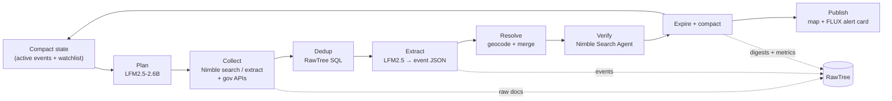

# Road Status Agent — Hackathon Build Guide

Sep 25, 2026 · @Jinxing Li

## The pitch

Build **RoadWatch SF**: an agent that runs for hours or days, watching news, social media and government feeds, and keeps a live map of which SF roads are closed, why, and until when.

The hackathon's stated problem is that long-horizon agents break down as observations and stale context pile up. Road status is a natural fit, because most road events expire: a farmers market ends at 2 pm, a parade clears, a flood recedes. So the core of the project isn't the scraping. It's an agent that **remembers active closures, forgets expired ones, and keeps its context small and stable no matter how long it runs.**

Frame every design choice and the demo around that. The headline judging chart: context tokens per cycle stay flat for RoadWatch while a naive "append everything" agent grows until it slows down and fails.

One-sentence pitch: *"A self-maintaining road-status agent that runs indefinitely on a small on-device model, because it forgets what no longer matters."*

## Architecture

One loop runs every few minutes. Each cycle starts from a compact state snapshot rather than from the full history.



1. **Plan.** The agent reads the compact state (about 2–4K tokens) and decides what to check: which areas are hot, which events need confirming, which sources are due.
2. **Collect.** Nimble search queries ("road closure San Francisco today", "Market St parade"), Nimble extract on government pages, and direct API pulls.
3. **Dedup.** Hash the URL and content, and skip anything already in RawTree.
4. **Extract.** LFM2.5 turns each new document into zero or more event records (schema below).
5. **Resolve.** Geocode street names, then match against existing events: same street, overlapping time, same type → merge and add the source. Otherwise create a new event.
6. **Verify.** A single low-trust source (one tweet) triggers a Nimble Web Search Agent run or an official-feed check. Confidence rises or the event decays.
7. **Expire and compact.** Retire events past their end time or with no fresh mentions, write a one-line digest, and drop them from working state.
8. **Publish.** Write GeoJSON for the map. High-severity new events get a FLUX-generated alert card.

Event record (freeze this schema in the first 30 minutes so all four people can build against it):

```json
{
  "event_id": "evt_2026-10-04_market-st_parade",
  "type": "parade | protest | strike | market | festival | fire | flood | tsunami | quake | crash | construction | other",
  "status": "scheduled | active | cleared | unconfirmed",
  "streets": ["Market St from Beale St to 8th St"],
  "geometry": {"type": "LineString", "coordinates": [[-122.396, 37.792], [-122.411, 37.779]]},
  "affects": ["cars", "muni", "pedestrians"],
  "starts_at": "2026-10-04T10:00:00-07:00",
  "ends_at": "2026-10-04T16:00:00-07:00",
  "severity": 1,
  "confidence": 0.85,
  "sources": [{"url": "...", "kind": "gov | news | social", "seen_at": "..."}],
  "summary": "Fleet Week parade closes Market St eastbound 10am–4pm"
}
```

## Sponsor tools

Each tool gets one clear job, and each job is visible in the demo. Nimble and the database tool carry the cash prizes, so make their use deep, not decorative.

| Tool | Role in RoadWatch | How to call it | Make it shine for judges |
| --- | --- | --- | --- |
| [Nimble](https://docs.nimbleway.com/nimble-sdk/getting-started/overview) | The agent's eyes: live web data from news, social and gov pages | `pip install nimble_python`; `nimble.search(...)`, `nimble.extract.run(url, formats=["markdown"])`, `nimble.agents.run(input=...)` for multi-step verification; REST at `sdk.nimbleway.com/v2/*` | Use all three modes: Search to discover, Extract for JS-heavy gov pages, Search Agent to verify a rumor with citations |
| [Liquid AI LFM2.5](https://www.liquid.ai/models) | The brain, on-device: extraction, planning and compaction | LFM2.5-2.6B (128K context, tool calling) for plan and compaction; LFM2.5-230M for bulk extraction. Run via llama.cpp, LM Studio, MLX or vLLM, or the [OpenRouter free endpoint](https://openrouter.ai/liquid/lfm-2.5-2.6b:free) | Show the whole agent running on a laptop. Constrain output with a JSON grammar (llama.cpp GBNF) so a small model emits valid records |
| [RawTree](https://rawtree.com/blog/introducing-rawtree) | Long-term memory: raw observations, the event ledger, digests, agent metrics | Schema-less JSON ingest: `POST api.rawtree.com/v1/tables/<name>`; SQL over HTTP: `POST /v1/query` | Memory recall is SQL, not context: "active events within 500 m", "has this parade happened before?" |
| [FLUX (Black Forest Labs)](https://bfl.ai/models/flux-kontext) | The visual layer: shareable alert cards for major events | BFL API; FLUX.1 Kontext edits an existing image (for example, a map tile) from a text instruction | One card per high-severity event, labeled "illustration" so nobody mistakes it for a photo |

Two things to confirm at kickoff:

- RawTree is in **private beta**, so request an API key now. The [event page](https://tokensand.com/horizonagentshack) lists **Tinybird** as the database sponsor with the prizes ($2,000 / $1,000 / $500). Ask the organizers whether RawTree counts for that track. Keep storage behind a thin `store.py` (ingest JSON + run SQL) so you can swap between them.
- Geocoding is not covered by any sponsor. Use the SF street-centerline dataset on DataSF or OSM Nominatim, and draw the map with Leaflet + OSM tiles.

## Memory design

This is the part judges will score hardest. Four tiers: only tier 3 ever enters the model's context.

| Tier | What it holds | Where | In context? |
| --- | --- | --- | --- |
| 0. Raw observations | Every fetched page, post and API record, with hash and timestamp | RawTree `observations` (append-only) | Never |
| 1. Event ledger | Every version of every event: status, geometry, confidence, sources | RawTree `road_events` | Only via SQL lookups |
| 2. Digests | One line per retired event and one summary per hour ("14:00–15:00: 3 new, 2 cleared, Market St parade confirmed") | RawTree `digests` | Only when recalled |
| 3. Working state | Active and recently changed events, one line each, plus the watchlist and source health | Rendered each cycle | Always, capped at \~4K tokens |

**Forgetting rules** (make these explicit in code and show them in the demo):

- Scheduled events (market, parade, festival) retire at `ends_at` plus a 30-minute buffer.
- Hazards (fire, flood, tsunami) stay until an official all-clear, never on silence alone.
- An unconfirmed social-only report decays: confidence drops each cycle and it is dropped after about 2 hours without corroboration.
- If working state exceeds the cap, the lowest severity × confidence events are summarized into a digest line first.

**Recall tools** the planner can call, each a parameterized SQL query: `active_events(bbox)`, `event_history(street)`, `seen(url_hash)`, `recurring(type, street)`. This is how the agent "remembers" last week's parade without carrying it in context.

**Metrics to log every cycle** (to a RawTree `agent_runs` table): prompt tokens, active events, new/merged/retired counts, latency, and precision against a small hand-labeled set. Run a naive baseline that appends every observation to its prompt, and plot both. That chart is your proof.

## Data sources

SF already publishes permitted closures as structured data. Use that as **ground truth and a baseline**, and let the agent's value be everything the official feed misses: protests, strikes, fires, crashes, flooding and last-minute changes.

| Source | What it gives | Access | Role |
| --- | --- | --- | --- |
| [DataSF Temporary Street Closures](https://data.sfgov.org/Transportation/Temporary-Street-Closures/8x25-yybr/data) | Permitted closures (markets, festivals, parades, block parties) with street segments and times; also published in [WZDx format](https://catalog.data.gov/dataset/temporary-street-closures-in-the-work-zone-data-exchange-wzdx-format) | Socrata JSON API, no key needed for light use | Ground truth for scheduled events; seeds the recurring-event calendar |
| [511 SF Bay Open Data](https://511.org/open-data/traffic) | Regional traffic events and work zones (Open511 and WZDx) | Free API token; request it before hack day | Crashes, incidents, freeway closures |
| NWS alerts (api.weather.gov) | Flood, tsunami, heat and wind warnings with zone polygons | Free, no key | Hazard triggers; the agent then searches for affected roads |
| Caltrans QuickMap / lane-closure feeds | State highway closures | Public JSON | Freeway and bridge coverage |
| Local news (SF Chronicle, SFGate, KQED, SF Standard, Mission Local) | Protests, strikes, fires, incidents | Nimble Search + Extract | Unscheduled events |
| Social (SFMTA, SFFD, SFPD and SF Emergency Management accounts, r/sanfrancisco) | Earliest signal, lowest trust | Nimble Search | Early warning; always needs corroboration |

Trust weights to start with: gov feed 0.95, official agency post 0.9, established news 0.8, single social post 0.3. An event needs ≥ 0.7 combined to show as "active" on the map.

Stay SF-only for the hackathon. Mention in the pitch that adding a city means adding sources, not changing the agent.

## Hack-day plan

You have 5.5 hours of build time (11:00 kickoff to 4:30 submission), so the loop must run end to end by 2:30 at the latest. Everything after that is polish and the demo.

| Time | Goal | Done when |
| --- | --- | --- |
| 11:00–11:30 | Repo, `.env`, event schema and `store.py` interface frozen | Everyone can import the schema and write one fake event to RawTree |
| 11:30–13:30 | Four parallel tracks (below) | Each track works alone with stubbed inputs |
| 13:30–14:00 | Lunch while wiring the tracks together | One real cycle: Nimble doc → LFM event → RawTree → map pin |
| 14:00–15:15 | Continuous loop, forgetting rules, replay mode, baseline agent | Loop runs 30+ cycles unattended without errors |
| 15:15–15:45 | Metrics chart, FLUX cards, UI polish | Token-per-cycle chart renders from `agent_runs` |
| 15:45–16:30 | Record demo video, README, submit | Submitted by 16:15, with 15 minutes spare |

**Four-person split:**

- **A — Ingest (Nimble).** Search and Extract wrappers, source scheduler, DataSF and 511 pulls, content hashing and dedup.
- **B — Model (Liquid AI).** Serve LFM2.5 locally, the extraction prompt with JSON grammar, the planner prompt, the compaction prompt. Owns the 20-document labeled test set.
- **C — Memory (RawTree).** Tables, recall SQL, event matching and merge, forgetting rules, working-state renderer, metrics logging, naive baseline.
- **D — Surface (FLUX + UI).** Leaflet map from GeoJSON, event timeline sidebar, metrics chart, FLUX alert cards, and the demo video.

**Replay mode is essential.** Real closures won't change much during a 3-minute demo. Collect a day's worth of articles, posts and closures ahead of time (for example, a weekend with a parade, a market and a protest). Then feed them in timestamp order at 1 simulated hour per 10 seconds. The audience watches events appear, merge, get confirmed and expire, and watches the context chart stay flat.

## Demo

Lead with the problem and end with the chart. About 3 minutes:

1. **(0:00–0:20) Problem.** "Roads close for parades, strikes, fires and floods. The information is scattered across a dozen sites, and an agent that watches them all eventually drowns in its own history."
2. **(0:20–1:30) Replay.** A simulated Saturday runs on the map: the Ferry Plaza market appears from DataSF; a protest shows up first as a single social post (grey, unconfirmed); Nimble's Search Agent finds a news report and it turns red; the market expires at 2 pm and disappears.
3. **(1:30–2:00) Under the hood.** Show one raw article, the LFM2.5 JSON it produced on the laptop, and the RawTree row. Call out each sponsor by name as it appears.
4. **(2:00–2:30) The proof.** RoadWatch's prompt tokens stay flat at \~3K for 200 cycles while the naive baseline climbs past 100K and starts failing. Add precision against the labeled set.
5. **(2:30–3:00) Recall and output.** Ask "has Market St closed like this before?" and the agent answers from a SQL recall, not from context. Close on a FLUX alert card ready to share.

## Prep checklist and risks

Do these before hack day. Check with the organizers whether pre-written code is allowed; keys, research and data collection normally are.

- [ ] Register all 4 teammates (host approval required; bring physical photo ID)
- [ ] Get API keys: Nimble, RawTree (private beta waitlist), BFL, 511.org token, OpenRouter as a fallback
- [ ] Ask the organizers whether RawTree or Tinybird counts for the database prize
- [ ] Download LFM2.5-2.6B and LFM2.5-230M (GGUF) and confirm llama.cpp runs them on each laptop
- [ ] Collect the replay dataset: one weekend of DataSF closures, news articles and social posts
- [ ] Hand-label 20 documents as the extraction test set
- [ ] Create an empty public GitHub repo and agree on the folder layout

| Risk | Fallback |
| --- | --- |
| No RawTree access in time | Same `store.py` interface over Tinybird, or local DuckDB for dev |
| Small model emits bad JSON or wrong streets | JSON grammar, few-shot examples, and a Pydantic validation plus retry step; keep 230M for extraction only |
| Geocoding is ambiguous ("Market St" spans miles) | Match to DataSF street segments; if unresolved, show the event in the sidebar without a map line |
| Nimble rate limits or credit burn | Cache every response in RawTree; replay mode needs no live calls |
| Scope creep | Cut in this order: FLUX cards, then the planner (use a fixed source schedule), then social. Never cut forgetting or the metrics chart |
| Misleading visuals | Label FLUX cards as illustrations; never generate fake photos of real incidents |

## Sources

- [Long Horizon Agents Hack — Luma](https://luma.com/horizonagentshack?tk=Rjcjtm)
- [Long Horizon Agents Hack — tokensand](https://tokensand.com/horizonagentshack)
- [Nimble SDK overview](https://docs.nimbleway.com/nimble-sdk/getting-started/overview)
- [Introducing RawTree](https://rawtree.com/blog/introducing-rawtree)
- [Liquid AI LFM2.5-2.6B release (MarkTechPost)](https://www.marktechpost.com/2026/08/06/liquid-ai-lfm2-5-2-6b-on-device-agentic-model/amp/)
- [Liquid AI models](https://www.liquid.ai/models)
- [FLUX.1 Kontext — Black Forest Labs](https://bfl.ai/models/flux-kontext)
- [DataSF Temporary Street Closures](https://data.sfgov.org/Transportation/Temporary-Street-Closures/8x25-yybr/data)
- [511 SF Bay traffic open data](https://511.org/open-data/traffic)
